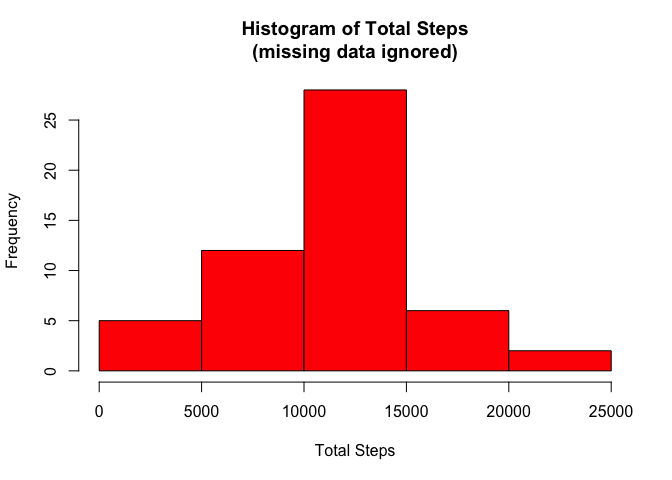
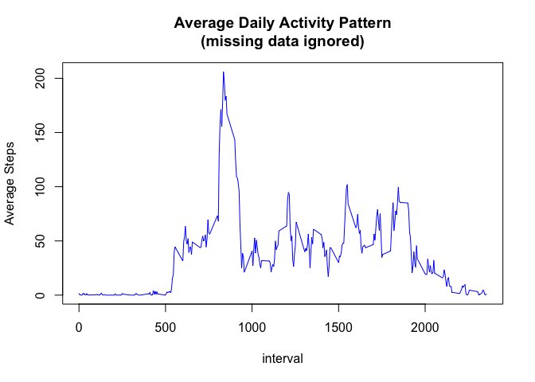
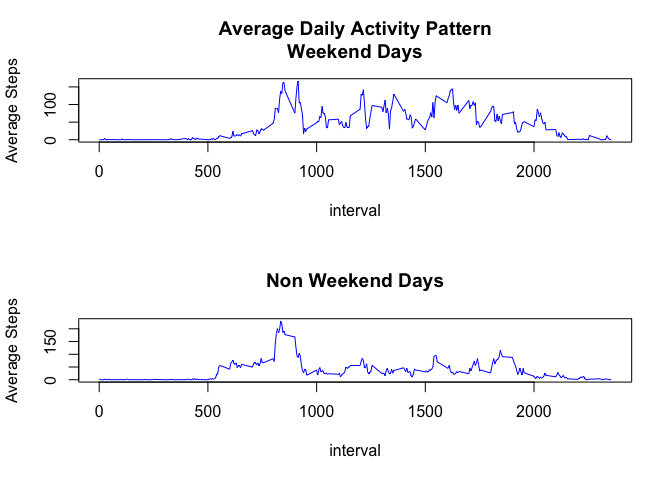
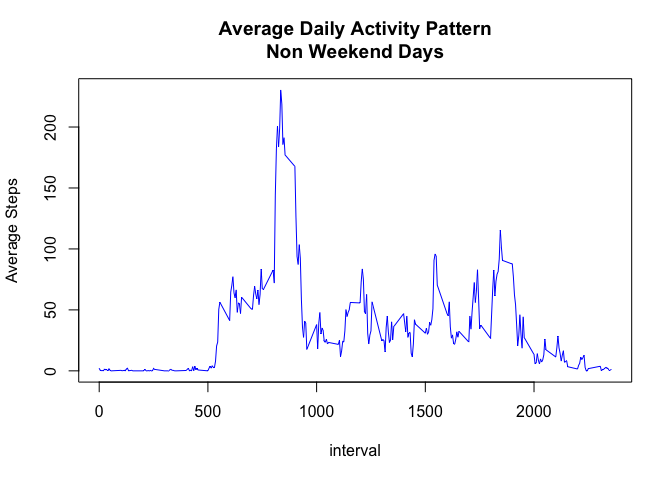

# Reproducible Research: Peer Assessment 1


## Loading and preprocessing the data
The data is loaded from the csv file, and two fields are added:
one for the day of the week and a flag to indicate whether it
is a weekend day.

```r
library(dplyr)
```

```
## 
## Attaching package: 'dplyr'
## 
## The following object is masked from 'package:stats':
## 
##     filter
## 
## The following objects are masked from 'package:base':
## 
##     intersect, setdiff, setequal, union
```

```r
actall <- read.csv("activity.csv")
actall$date <- as.Date(actall$date, format="%Y-%m-%d")
#Add fields for day of the week and the weekend flag
mutate(actall, actall$day <- weekdays(date, abbreviate=TRUE))
mutate(actall, actall$weekend <- ifelse(day %in% c("Sat", "Sun"), "y", "n"))
act <- filter(actall, is.na(steps) == FALSE)

bydate <- group_by(act, date)
bydate <- summarize(bydate, sum(steps))
names(bydate) <- c("date", "totalsteps")
```


## What is mean total number of steps taken per day?
 


```r
hist(bydate$totalsteps, xlab = "Total Steps", main = "Histogram of Total Steps\n(missing data ignored)", col = "red")
```

 

```r
print(summary(bydate$totalsteps))
```

```
##    Min. 1st Qu.  Median    Mean 3rd Qu.    Max. 
##      41    8841   10760   10770   13290   21190
```

```r
#m <- filter(bydate, bydate$averagesteps == max(bydate$averagesteps))
```

### The mean total number of steps taken per day is: 10766 


## What is the average daily activity pattern?

```r
bydate <- group_by(act, interval)
bydate <- summarise(bydate, round(mean(steps), digits=1))
names(bydate) <- c("interval", "averagesteps")

plot(bydate, type = "l", main = "Average Daily Activity Pattern\n(missing data ignored)", ylab = "Average Steps", col = "blue")
```

 

```r
m <- filter(bydate, bydate$averagesteps == max(bydate$averagesteps))
print(summary(bydate))
```

```
##     interval       averagesteps   
##  Min.   :   0.0   Min.   :  0.00  
##  1st Qu.: 588.8   1st Qu.:  2.50  
##  Median :1177.5   Median : 34.10  
##  Mean   :1177.5   Mean   : 37.38  
##  3rd Qu.:1766.2   3rd Qu.: 52.88  
##  Max.   :2355.0   Max.   :206.20
```
### Which 5-minute interval, on average across all the days in the dataset, contains the maximum number of steps?: 835


## Imputing missing values
Now we replace all NA steps values for each interval with the average with that interval for the 
data set.

```r
act <- actall
# Replace NA steps with average for that interval across the table
for(i in unique(act$interval))
{
        x <- filter(act, interval == i & is.na(steps) == FALSE)
        act <- mutate(act, steps = ifelse(is.na(steps) == TRUE & interval == i, round(mean(x$steps), digits=1), steps))
}
```


## Are there differences in activity patterns between weekdays and weekends?
We can see from the following plots that on weekdays there is one major peak in the morning,
but during the weekend there are several peaks throughout the day

```r
# Ave for weekend only
actw <- filter(act, weekend=="y")
bydate <- group_by(actw, interval)
bydate <- summarise(bydate, round(mean(steps), digits=1))
plot(bydate, type = "l", main = "Average Daily Activity Pattern\nWeekend Days", ylab = "Average Steps", col = "blue")
```

 

```r
print(summary(bydate))
```

```
##     interval      round(mean(steps), digits = 1)
##  Min.   :   0.0   Min.   :  0.00                
##  1st Qu.: 588.8   1st Qu.:  1.20                
##  Median :1177.5   Median : 32.35                
##  Mean   :1177.5   Mean   : 42.36                
##  3rd Qu.:1766.2   3rd Qu.: 74.62                
##  Max.   :2355.0   Max.   :166.60
```

```r
# Ave for non weekend only
actw <- filter(act, weekend=="n")
bydate <- group_by(actw, interval)
bydate <- summarise(bydate, round(mean(steps), digits=1))
plot(bydate, type = "l", main = "Average Daily Activity Pattern\nNon Weekend Days", ylab = "Average Steps", col = "blue")
```

 

```r
print(summary(bydate))
```

```
##     interval      round(mean(steps), digits = 1)
##  Min.   :   0.0   Min.   :  0.00                
##  1st Qu.: 588.8   1st Qu.:  2.20                
##  Median :1177.5   Median : 25.80                
##  Mean   :1177.5   Mean   : 35.61                
##  3rd Qu.:1766.2   3rd Qu.: 50.83                
##  Max.   :2355.0   Max.   :230.40
```


